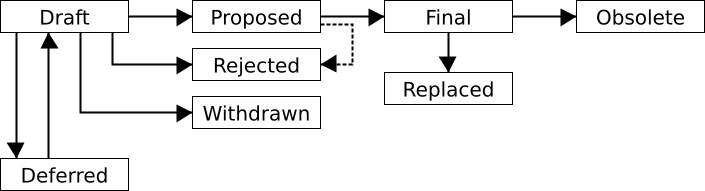

# dev-0000: EPM Improvement Proposal (EIP) Process

```
Author:   Andres Correa Casablanca <andreu@kindspells.dev>
Status:   Draft
Created:  2024-10-27
```

## Abstract

An EPM Improvement Proposal (EIP) is a design document providing information to
the EPM community. This can be a new feature description, proposals for internal
architecture changes, proposals for changes in development processes...

An EIP should provide a concise technical specification and a rationale for the
proposed change, regardless of its nature (new feature, feature deprecation,
internal architecture changes, changes on development processes...).

We intend EIPs to be the primary mechanisms for proposing new features, for
collecting community input on an issue, and for documenting the design decisions
that have gone into EPM. The EIP author is responsible for building consensus
within the community and documenting dissenting opinions.

Because the EIPs are maintained as text files in a versioned repository, their
revision history is the historical record of the feature proposal.

This document defines the process for creating, discussing, and approving EIPs.


## Motivation

We need a process and format to have design discussions and decisions about EPM
features and architecture. These designs affect implementations so we need a
structured process that help us to conduct an effective discussion.


## Specification

### Document format

The document MUST be saved in Markdown and MUST use a naming convention as:
`[dev|feat|arch]-xxxx-short-title.md`, where `xxxx` is the number of the EIP
left-padded with zeroes.

Requirements MUST be indicated as described in
[RFC2119](https://www.ietf.org/rfc/rfc2119.txt).

You can use the template [dev-0000-eips.md](dev-0000-eips.md) as a starting
point which already is formatted in the correct way.

#### Sections

Every EIP document MUST contain the following sections.

##### Title

A concise title of the EIP. The title should contain the EIP number.
Example: `# dev-0000: EPM Improvement Proposal (EIP) Process`.

##### Preamble

Headers containing metadata about the EIP. The header block MUST be enclosed in
triple backticks to mark it up as code block. You can use this EIP as an
example.

The preamble has the following fields:

* `Author`: Name and email address of author of the EIP in the format `Jane
  Smith <jsmith@example.com>`
* `Co-Author`: Name and email address of additional authors of the EIP in the
  same format as in `Author` (field can occur multiple times)
* `Status:` One of [`Draft`, `Deferred`, `Withdrawn`, `Proposed`, `Rejected`,
  `Final`, `Replaced`, or `Obsolete`] (definition of the status values is
  defined in section [EIP Life Cycle](#eip-life-cycle))
* `Created:` Creation date in the format YYYY-mm-dd
* `Superseded:` When the EIP was considered to be replaced by another EIP, in
  the format YYYY-mm-dd
* `Superseded-by:` Number of the EIP which supersedes this EIP
* `Supersedes:` Any other EIPs this EIP supersedes

`Author`, `Status` and `Created` MUST be present in all EIPs.

`Co-Author` fields MAY be added to attribute the content of an EIP to multiple
authors. The author from the `Author` field is the prime responsible person in
terms of the EIP process, though.

`Superseded` and `Superseded-by` MUST be added when EIP has status `Replaced`.
`Supersedes` MUST be added if the EIP invalidates any other EIPs.

##### Abstract

A short (~200 word) description of the technical issue being addressed.

##### Motivation

The motivation is critical for EIPs that want to change the EPM interface. It
should clearly explain why the existing interface is inadequate to address the
problem that the EIP solves.

##### Specification

The technical specification should describe the syntax and semantics of any new
feature. The specification should be detailed enough to allow competing,
interoperable implementations of EPM alternatives.

##### Rationale

The rationale fleshes out the specification by describing what motivated the
design and why particular design decisions were made. It should describe
alternate designs that were considered and related work. The rationale should
provide evidence of consensus within the community and discuss important
objections or concerns raised during discussion.

##### Backwards compatibility

All EIPs that introduce backwards incompatibilities MUST include a section
describing these incompatibilities and their severity. The EIP MUST explain how
the author proposes to deal with these incompatibilities.

##### Reference implementation

A proposal MUST have a _"reference implementation"_ before it can move from
`Draft` to `Proposed`. The terms _"reference implementation"_ and
_"proof-of-concept"_ can be used interchangeably here. The point is that the
idea has gone through a phase of implementation so that it is a tested idea, and
issues which only can be found when actually trying to implement it have been
found and addressed.

It is better to finish the specification and rationale first and reach consensus
on it before writing code, though.

To go from `Proposed` to `Final` there MUST be a full, released implementation.
That's the prerequisite for getting real-world adoption. The final
implementation MUST include test code and documentation.

##### Copyright

All EIPs MUST be dual-licensed under
[CC BY-SA 4.0](https://creativecommons.org/licenses/by-sa/4.0/) and
[GPL 3.0](https://www.gnu.org/licenses/gpl-3.0.en.html).

#### Optional sections

If the EIP is updated through a pull request in a non-trivial way then these
non-trivial changes SHOULD be listed in the `Changelog` section.

Other sections MAY be added to provide additional context or clarity.

#### Auxiliary files

EIPs MAY include auxiliary files such as diagrams. Auxiliary files should be
included in a subdirectory for that EIP which MUST be named `files/eip-XXXX`
where "XXXX" is the EIP number.

### Process

We MUST host all the EIPs documents on Github and propose them via the
Pull Request mechanism, this will allow us to conduct review processes in a
public and collaborative way.

The EIP document is updated through subsequent pull requests. This includes in
particular changes to the status of the EIP. The `Status` field in the preamble
of the document MUST reflect those changes. Discussion about acceptance of
status changes happens in the pull requests. The definition of the status and
its transitions is defined in the [EIP life cycle](#eip-life-cycle) section.

In the case of a new EIP superseding a document, the pull request for the new
EIP MUST also take care of changing the status of the document to be superseded.

#### EIP life cycle

The author is responsible for driving the EIP and establishing [rough
consensus](https://tools.ietf.org/html/rfc7282) about the proposal. The status
of the EIP reflects the different states the proposal goes through during this
process. The status MUST be recorded in the `Status` field of the preamble of
the document.

The typical paths of the status of EIPs are as follows:



New EIPs are submitted as `Draft`. This is the state where the discussion about
acceptance of the proposal is happening and the proposal might be changed to
incorporate feedback from the discussion.

Authors of an EIP may decide on their own to change the status from `Draft` to
`Withdrawn` if they retract their proposal and won't pursue it further.

Authors of an EIP may decide on their own to change the status from `Draft` to
`Deferred` if they postpone the proposal but intend to pick it up at a later
point in time.

A EIP may only change status from `Draft` to `Proposed`, when the author deems
it is complete, has a working implementation (where applicable), and has
community plans to move it to the `Final` status.

EIPs in the `Proposed` status serve as design specification for implementations.
Implementations SHOULD note which EIPs they support.

EIPs SHOULD be changed from `Draft` or `Proposed` status to `Rejected` status,
upon request by any person, if they have not made progress in three years. Such
an EIP may be changed to `Draft` status if the author provides revisions that
meaningfully address public criticism of the proposal, or to `Proposed` status
if it meets the criteria required as described in the previous paragraphs.

A `Proposed` EIP may progress to `Final` only when specific criteria reflecting
real-world adoption have occurred. This is different for each EIP depending on
the nature of its proposed changes. Evaluation of this status change should be
objectively verifiable, and/or be discussed by the community. The EIP SHOULD
include a definition of the criteria.

When a `Final` EIP is no longer relevant, its status may be changed to
`Replaced` or `Obsolete`. If it is replaced by another EIP then the status MUST
be changed to `Replaced` and the EIPs which supersede it MUST be noted in the
preamble. If the EIP does not apply anymore and there is no successor EIP the
state MUST be changed to `Obsolete`. These changes must also be objectively
verifiable and/or discussed.


## Rationale

The EIP process is an evolution of the ADR process used for recording decisions
by the EPM community. While the ADR is adequate for decisions on the code or
process level and provides an immutable record of decisions for later reference,
the EIP process addresses design decisions on the architecture and feature-space
level. They also serve as a specification and are mutable documents reflecting
the evolution of a design.

The process is inspired by the
[UIP process](https://github.com/dtr-org/uips/blob/master/UIP-0001.md), which in
turn is inspired by the
[BIP process](https://github.com/bitcoin/bips/blob/master/bip-0002.mediawiki),
which is based on the [PEP process](https://www.python.org/dev/peps/pep-0001/).
Other similar processes are the
[EIP process (Ethereum)](https://github.com/ethereum/EIPs/blob/master/EIPS/eip-1.md)
and the [Rust RFC process](https://github.com/rust-lang/rfcs). They all are
inspired by the [IETF RFC process](https://www.ietf.org/standards/process/).

Following a similar process as other communities should make it easier to
understand and follow the process. It also builds on the insight others have
gathered over time.


## Reference implementation

EIP dev-0000 can be seen as the reference implementation for the EIP process.

We will use this as criteria for moving the status from EIP dev-0000 from
`Draft` to `Proposed`: Once we have exercised the process by writing a new EIP
document we will consider the reference implementation to be done and move to
the `Proposed` status.


## Adoption considerations

As for all other design documents we consider real-world adoption as criteria
when to move the status of EIP dev-0000 from `Proposed` to `Final`. If at least
one EIP submitted from outside of the initial core team has moved to `Proposed`
and at least one EIP has moved to `Final` we will consider the process to be
adopted and change the status of EIP dev-0000 to `Final`.


## Copyright

This document and all its auxiliary files are dual-licensed under
[CC BY-SA 4.0](https://creativecommons.org/licenses/by-sa/4.0/) and
[GPL 3.0](https://www.gnu.org/licenses/gpl-3.0.en.html).
